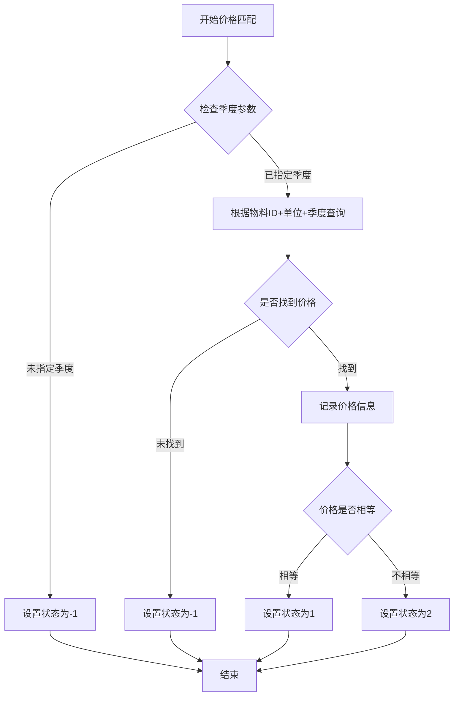

# 乙供物资价格匹配状态说明文档

## 版本信息
- **版本**: v1.1.2
- **更新日期**: 2025-01-10
- **影响接口**: 乙供物资解析和匹配相关接口

## 价格匹配状态变更说明

### 状态码定义

| 状态码 | 状态名称 | 含义说明 | 业务场景 |
|--------|----------|----------|----------|
| `-1` | 价格信息不全 | 物资信息未找到，该物资和单位在该季度下未找到价格 | 需要管理员新增价格信息或用户调整结算季度 |
| `1` | 精确匹配成功 | 物资信息+单位+季度找到了价格，且价格相等 | 自动匹配成功，无需人工干预 |
| `2` | 价格不一致 | 找到价格，但是价格信息不一致 | 找到对应价格记录，但价格数值不相等，需人工确认 |

### 原有状态对比

| 原状态 | 新状态 | 变更说明 |
|--------|--------|----------|
| `0` (失败) | `-1` | 更明确地表示价格信息不全 |
| `1` (成功) | `1` | 保持不变，表示精确匹配成功 |
| 无 | `2` | 新增状态，表示找到价格但不匹配 |

## 接口响应变更

### 查询乙供物资匹配结果接口
- **接口路径**: `GET /materials/partyb/query`
- **响应字段变更**: `matchOptions[].priceMatchedStatus` 字段的可能值扩展

#### 响应示例
```json
{
  "code": 0,
  "data": {
    "content": [
      {
        "taskDataId": "xxx",
        "materialName": "钢筋",
        "matchOptions": [
          {
            "matchResultId": "xxx",
            "priceMatchedStatus": 1,  // 新的状态值：-1, 1, 2
            "baseInfo": { /* 基础信息 */ },
            "priceOptions": [ /* 价格选项 */ ]
          }
        ]
      }
    ]
  }
}
```

#### MaterialMatchOptionVO 字段说明
| 字段名称 | 类型 | 说明 |
|---------|------|------|
| matchResultId | String | 匹配结果ID |
| matchedId | String | 匹配的基础数据ID |
| matchScore | Integer | 匹配分数（0-100） |
| matchType | Integer | 匹配类型（1：精确匹配，2：相似匹配，3：历史匹配） |
| **priceMatchedStatus** | **Integer** | **价格匹配状态（-1：价格信息不全，1：精确匹配，2：价格不一致）** |
| baseInfo | MaterialBaseInfoVO | 基础数据信息 |
| priceOptions | List&lt;MaterialPriceInfoVO&gt; | 可用价格列表 |

### 乙供物资匹配处理接口
- **接口路径**: `POST /materials/partyb/match`
- **处理逻辑变更**: 内部匹配逻辑优化，对外接口保持兼容

## 业务逻辑变更

### 匹配策略调整
1. **原策略**: 只有价格完全相等时才记录匹配信息
2. **新策略**: 只要单位和季度匹配就记录价格信息，然后判断价格是否相等

### 匹配流程优化


## 前端处理建议

### 状态展示
```javascript
const getStatusDisplay = (status) => {
  switch(status) {
    case -1:
      return {
        text: '价格信息不全',
        color: 'red',
        action: '联系管理员新增价格或调整季度'
      };
    case 1:
      return {
        text: '精确匹配',
        color: 'green',
        action: '自动匹配成功'
      };
    case 2:
      return {
        text: '价格不一致',
        color: 'orange',
        action: '需要人工确认'
      };
    default:
      return {
        text: '未知状态',
        color: 'gray',
        action: '请联系技术支持'
      };
  }
};
```

### 处理建议
1. **状态-1**: 提示用户调整季度参数或联系管理员
2. **状态1**: 显示为成功匹配，可自动确认
3. **状态2**: 显示价格差异，提供人工确认选项

## 注意事项

1. **向后兼容性**: 现有前端代码需要更新以处理新的状态值
2. **状态0移除**: 原有的状态0已被状态-1替代
3. **价格记录**: 即使价格不匹配（状态2），也会记录找到的价格信息
4. **日志增强**: 新增了详细的匹配过程日志，便于问题排查

## 升级影响

### 数据库
- 无需数据库结构变更
- 现有数据保持不变

### 接口
- 响应数据结构保持不变
- 仅价格匹配状态字段的值范围扩展

### 前端
- 需要更新状态处理逻辑
- 建议增加新状态的展示和处理

## 测试建议

1. **状态-1测试**: 使用不存在的季度或物料信息
2. **状态1测试**: 使用完全匹配的价格数据
3. **状态2测试**: 使用存在但价格不匹配的数据
4. **边界测试**: 测试null值、空字符串等边界情况