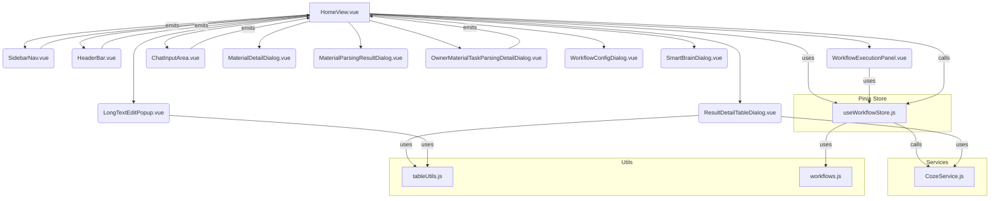

# HomeView.vue 重构方案

## 分析结果：

1.  **组件结构：** `HomeView.vue` 是一个大型的父组件，集成了 `SidebarNav`、`HeaderBar`、`WorkflowExecutionPanel` 等多个子组件，以及 `MaterialDetailDialog`、`WorkflowConfigDialog`、`SmartBrainDialog` 等大量弹窗组件，还有内联定义的表格和长文本编辑对话框。
2.  **数据流：** 数据主要通过 `props` 从 `HomeView` 传递给子组件，子组件通过 `emits` 向父组件通信。所有状态管理（包括 UI 状态、业务数据、消息队列等）都通过 `ref` 和 `reactive` 在 `HomeView.vue` 内部进行，未发现使用 Vuex 或 Pinia 等集中式状态管理库。
3.  **交互逻辑：** 用户交互（如侧边栏选择、聊天输入、表格编辑）直接在 `HomeView.vue` 中触发方法调用，这些方法包含了大量的业务逻辑，包括 Coze API 调用、数据处理和 UI 更新。特别是聊天输入会根据内容动态触发功能选择。
4.  **模块依赖：** 依赖 Vue 核心 API、Element Plus UI 组件、本地组件（`SidebarNav`、`HeaderBar` 等）、以及 `CozeService`（用于与 Coze API 交互）和 `functions`（定义工作流功能）。

**总结分析：** `HomeView.vue` 存在严重的“巨石”组件问题，导致高耦合、低可维护性、低可读性、潜在性能隐患和复用性差。

---

## 重构方案：

**核心思想：** 组件拆分、状态管理集中化（引入 Pinia）、逻辑解耦、布局优化。

### 1. 布局优化与侧边栏控制：

*   **左侧边栏默认隐藏：**
    *   在 `HomeView.vue` 中新增响应式变量 `isSidebarOpen`，默认为 `false`。
    *   `SidebarNav` 组件的显示/隐藏通过 `v-if` 或 `v-show` 绑定到 `isSidebarOpen`，并添加 CSS 过渡效果。
    *   在 `HeaderBar` 中添加一个可切换侧边栏状态的按钮（例如汉堡菜单图标），点击时切换 `isSidebarOpen` 的值。
    *   调整 `main-container` 的样式，使其在侧边栏隐藏时占据更多空间。
*   **布局简洁化：** 考虑使用 Element Plus 的 `el-aside` 和 `el-main` 布局，将 `SidebarNav` 放入 `el-aside`，`HeaderBar` 和 `el-main` 放入 `el-container`。

### 2. 组件拆分与职责分离：

*   **`HomeView.vue` (重构后):** 仅负责整体布局、顶层 UI 状态管理和协调不同功能模块的交互。
*   **拆分出的新组件 (或现有组件的增强):**
    *   **`ChatInputArea.vue`:** 提取聊天输入框的模板和逻辑，通过 `v-model` 和 `@send-message` 事件与父组件通信。
    *   **`ResultDetailTableDialog.vue`:** 提取“解析结果详情”的 `el-dialog` 及其内部的表格、编辑逻辑和 Coze 服务调用。
    *   **`LongTextEditPopup.vue`:** 提取“编辑长文本的对话框”及其内部逻辑。
    *   **`ExecutionHistoryPanel.vue`:** 如果需要独立显示执行历史，则提取相关逻辑。

### 3. 状态管理优化 (引入 Pinia):

*   **创建 Pinia Store (例如 `src/stores/workflow.js`):**
    *   将所有与工作流执行、消息队列、任务状态、表格数据、智能体数据等相关的响应式数据 (`state`) 和方法 (`actions`) 移入 Store。
    *   将计算属性 (`getters`) 也移入 Store。
    *   `HomeView` 将通过 `useWorkflowStore()` 访问和操作这些状态和方法。
*   **`CozeService` 保持不变：** `CozeService` 作为一个独立的 API 服务层，继续负责与后端 Coze API 的交互，Store 将调用 `CozeService` 的方法。
*   **对话流触发功能保持不变：**
    *   `handleSendMessage` 中的 `cozeService.runChat` 回调逻辑将保持在 `HomeView` 或移至 Pinia Store 的相应 Action 中。
    *   回调中根据 `agentMessage.content` 触发 `handleFunctionSelect` 的逻辑将改为调用 Pinia Store 中对应的 Action（例如 `workflowStore.selectFunction(functionId)`）。
    *   这个 Action 将负责更新 `activeFunction` 状态并设置 `showWorkflowConfig` 为 `true`，从而确保上传窗口的正常打开。

### 4. 逻辑解耦与代码改进建议：

*   **将 `headerMapping` 抽离：** 移至独立的工具文件 (`src/utils/tableUtils.js`) 或 `ResultDetailTableDialog` 内部。
*   **统一错误处理：** 建立统一的错误处理机制。
*   **优化 `parseResultJsonData`：** 确保其健壮性。
*   **简化 `executeWorkflow`：** 将不同功能 (`func.id`) 对应的 Coze 服务调用逻辑封装到独立的函数中，并在 `executeWorkflow` 中路由调用。
*   **移除冗余导入：** 移除未使用的组件导入。
*   **Coze API Key 管理：** 将 API Key 移至环境变量 (`.env` 文件)。
*   **类型定义：** 为关键数据结构添加 TypeScript 接口或 JSDoc 类型。
*   **代码风格统一：** 确保整个项目遵循一致的代码风格。

### 5. 潜在性能优化点：

*   **消息列表虚拟化：** 对于 `displayedMessages` 这种可能包含大量数据的列表，考虑使用虚拟列表组件（如 `vue-virtual-scroller` 或 Element Plus 的虚拟滚动）。
*   **计算属性优化：** 检查并优化计算属性，避免不必要的重复计算。
*   **按需加载弹窗组件：** 使用 `defineAsyncComponent` 对大型弹窗组件进行懒加载。
*   **数据深拷贝优化：** 评估 `JSON.parse(JSON.stringify())` 的使用，考虑更高效的深拷贝方法或避免不必要的深拷贝。
*   **事件监听器清理：** 确保 `setInterval` 在组件销毁时被正确清除。

### 6. 提升代码可维护性：

*   **模块化和文件结构：** 按照功能和职责重新组织文件，例如：
    *   `src/views/HomeView.vue`: 顶层视图。
    *   `src/stores/workflow.js`: Pinia Store。
    *   `src/components/home/ChatInputArea.vue`: 聊天输入组件。
    *   `src/components/home/ResultDetailTableDialog.vue`: 表格详情弹窗。
    *   `src/utils/tableUtils.js`: 表格工具函数。
*   **命名规范、注释和文档：** 统一命名，为复杂逻辑和组件接口添加详细注释。
*   **测试：** 拆分后的组件和 Store 更容易进行单元测试。

### 7. 保持现有调用逻辑不变：

*   通过 Pinia Store 封装所有业务逻辑，并确保 `HomeView` 仍然通过调用 Store 的 Actions 来触发功能，从而保持外部对 `HomeView` 的调用接口不变。
*   子组件通过 `props` 接收数据，通过 `emits` 向上通知事件，保持组件间的通信模式。
*   **重要提示：** 重构将严格遵循不影响任何现有功能的原则，特别是对话流返回值调用模拟点击打开上传窗口的功能，将通过 Pinia Store 的 Actions 机制进行维护和调用，确保其功能完整性。

### 重构后的组件结构图：



### 重构后的数据流图 (简化):

```mermaid
graph LR
    User --> HomeView
    HomeView -- props/emits --> SidebarNav
    HomeView -- props/emits --> HeaderBar
    HomeView -- props/emits --> WorkflowExecutionPanel
    HomeView -- props/emits --> ChatInputArea
    HomeView -- props/emits --> Dialogs[各种弹窗组件]

    HomeView -- calls actions --> WorkflowStore[useWorkflowStore]
    WorkflowStore -- manages state --> State[响应式数据]
    WorkflowStore -- calls --> CozeService[CozeService]
    CozeService -- API calls --> Backend[Coze API]

    WorkflowExecutionPanel -- emits events --> HomeView
    ChatInputArea -- emits events --> HomeView
    SidebarNav -- emits events --> HomeView
    HeaderBar -- emits events --> HomeView
    Dialogs -- emits events --> HomeView

    State -- updates --> HomeView[HomeView.vue]
    State -- updates --> WorkflowExecutionPanel
    State -- updates --> Dialogs