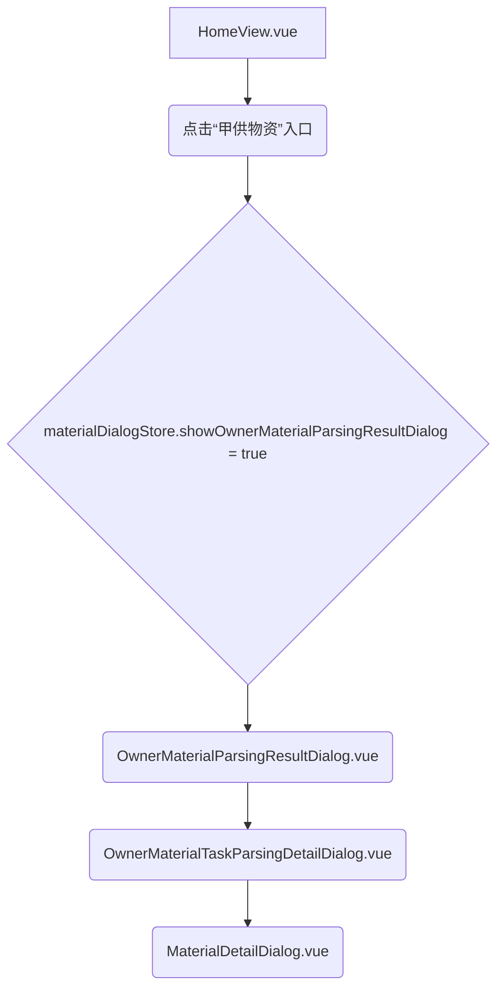

## 甲供物资实现方案

### 1. 数据模型设计

由于“甲供物资”的数据结构与“乙供物资”完全一致，我们可以复用现有数据模型。核心数据模型将包括：

- **物资详情数据模型**：与 [`MaterialDetailDialog.vue`](src/components/home/MaterialDetailDialog.vue) 中 `tableData` 的结构保持一致，包含 `material_name`, `material_specification`, `material_price`, `matched_name`, `matched_specification`, `matched_price`, `similarity`, `match_type` 等字段，以及用于操作的 `selected_material`, `selected_price_quarter`, `price_quarter_options` 等。
- **任务列表数据模型**：与 [`MaterialParsingResultDialog.vue`](src/components/home/MaterialParsingResultDialog.vue) 中 `tasks` 的结构保持一致，包含 `ID`, `CREATED_TIME`, `file_count`, `file_done_count`, `file_error_count` 等字段。

### 2. 前端组件规划

为了实现“甲供物资”的展示和交互，我们将采取以下组件策略：

- **复用现有组件**：
  - [`MaterialDetailDialog.vue`](src/components/home/MaterialDetailDialog.vue)：此组件用于展示物资详情和处理匹配操作。由于“甲供物资”的展示界面和解析逻辑与“乙供物资”相同，我们可以通过传入不同的 `taskId` 和 `detailId` 来复用此组件。组件内部需要根据传入的 `taskId` 调用对应的 Coze 工作流ID。
  - [`MaterialSelectionDialog.vue`](src/components/home/MaterialSelectionDialog.vue)：用于手动选择匹配物资的弹窗，可直接复用。
  - [`OwnerMaterialTaskParsingDetailDialog.vue`](src/components/home/OwnerMaterialTaskParsingDetailDialog.vue)：此组件用于展示某个任务下的文件解析详情列表。由于“甲供物资”也需要任务列表展示，且逻辑类似，可以考虑复用或在其基础上进行少量修改以适应“甲供物资”的上下文。
- **新增组件（可选，推荐）**：
  - `OwnerMaterialParsingResultDialog.vue` (或类似名称)：为了清晰区分“甲供物资”和“乙供物资”的任务列表，建议新增一个专门用于展示“甲供物资”解析任务列表的组件。该组件的结构和逻辑将与 [`MaterialParsingResultDialog.vue`](src/components/home/MaterialParsingResultDialog.vue) 高度相似，但会处理“甲供物资”相关的任务数据和工作流ID。

**组件之间的数据传递：**

- **父组件到子组件**：通过 `props` 传递 `taskId`、`detailId`、`show`（控制弹窗显示）以及任务列表数据。
- **子组件到父组件**：通过 `emit` 事件通知父组件状态变化，例如关闭弹窗 (`update:modelValue`) 或触发查看详情 (`view-detail`)。
- **通过 Pinia Store**：对于跨组件或全局共享的状态，如弹窗的显示状态、当前选中的任务ID/详情ID等，通过 Pinia Store 进行管理。

#### Mermaid 图：组件交互概览

```mermaid
graph TD
    A[HomeView.vue] -->|打开弹窗| B(OwnerMaterialParsingResultDialog.vue)
    B -->|查看详情 (taskId)| C(OwnerMaterialTaskParsingDetailDialog.vue)
    C -->|查看详情 (detailId, taskId)| D(MaterialDetailDialog.vue)
    D -->|选择物资| E(MaterialSelectionDialog.vue)
    D -->|调用 MaterialService| F(MaterialService.js)
    F -->|调用 CozeService| G(Coze API)
    D -->|调用 CozeService| G
    C -->|调用 CozeService| G
    B -->|调用 CozeService| G
    A -- Pinia Store --> B
    A -- Pinia Store --> C
    A -- Pinia Store --> D
    B -- Pinia Store --> C
    C -- Pinia Store --> D
```

### 3. 状态管理规划

我们将利用 Pinia Store 来管理“甲供物资”相关的状态。

- **修改现有 Store 模块**：
  - [`src/stores/materialDialog.js`](src/stores/materialDialog.js)：此 Store 已经包含了 `handleViewOwnerMaterialDetail` 用于处理“甲供物资”详情的逻辑。我们需要在此 Store 中新增或修改状态来管理“甲供物资”任务列表的显示状态和相关数据。
    - 新增 `showOwnerMaterialParsingResultDialog` (boolean) 用于控制“甲供物资”任务列表弹窗的显示。
    - 新增 `ownerMaterialParsingResultTasks` (Object) 用于存储“甲供物资”任务列表数据（all, completed, inProgress）。
    - 新增 `ownerMaterialParsingResultLoading` (boolean) 用于控制任务列表的加载状态。
    - 新增 `handleViewOwnerMaterialParsingResult` action，用于获取并设置“甲供物资”任务列表数据。
  - [`src/stores/parsingResult.js`](src/stores/parsingResult.js)：此 Store 主要处理解析结果的通用逻辑。由于“甲供物资”的解析逻辑与“乙供物资”相同，`parseResultJsonData`、`isLongText`、`openEditPopup`、`saveLongText`、`startRowEdit`、`cancelRowEdit`、`saveRowEdit` 等方法可以复用。`handleSaveAll` 和 `handleConfirm` 需要根据传入的 Coze 工作流ID进行区分。

#### Mermaid 图：Pinia Store 结构

```mermaid
graph TD
    A[Pinia Root] --> B(materialDialogStore)
    B --> B1(showMaterialDetailDialog)
    B --> B2(materialDetailDialogTaskId)
    B --> B3(materialDetailDialogDetailId)
    B --> B4(showOwnerMaterialTaskParsingDetailDialog)
    B --> B5(ownerMaterialTaskParsingDetailTaskId)
    B --> B6(handleViewOwnerMaterialDetail)
    B --> B7(handleViewMaterialResultDetail)
    B --> B8(showOwnerMaterialParsingResultDialog)
    B --> B9(ownerMaterialParsingResultTasks)
    B --> B10(ownerMaterialParsingResultLoading)
    B --> B11(handleViewOwnerMaterialParsingResult)

    A --> C(parsingResultStore)
    C --> C1(showResultDetail)
    C --> C2(tableData)
    C --> C3(tableColumns)
    C --> C4(handleViewResultDetail)
    C --> C5(handleSaveAll)
    C --> C6(handleConfirm)
```



### 4. 服务层规划

在 `src/services/MaterialService.js` 中，我们将新增或修改 API 调用。由于 Coze 工作流将作为数据源，`MaterialService` 将主要负责调用 CozeService 来触发这些工作流。

- **修改 [`src/services/MaterialService.js`](src/services/MaterialService.js)**：

  - 引入 `CozeService`。
  - 新增方法来调用 Coze 工作流，以获取“甲供物资”的任务列表、详情数据、保存修改、获取匹配列表等。
  - **模拟方式**：在开发阶段，可以通过在 Coze 工作流中配置 mock 数据来模拟后端返回。例如，为获取任务列表的工作流配置一个返回固定任务列表的 JSON 响应。对于详情数据，可以配置返回一个包含多条物资详情的 JSON 数组。

  ```javascript
  // src/services/MaterialService.js
  import request from '@/utils/request.js'
  import CozeService from '@/uitls/coze.js' // 引入 CozeService

  const BASE_URL = '/api'
  const cozeService = new CozeService('YOUR_COZE_API_TOKEN') // 替换为实际的 Coze API Token

  class MaterialService {
    // ... 现有 queryPriceInfoList 方法

    /**
     * 获取甲供物资解析任务列表
     * @param {string} workflowId - Coze 工作流ID
     * @returns {Promise<Object>} 任务列表数据
     */
    async fetchOwnerMaterialParsingTasks(workflowId) {
      try {
        // 假设 Coze 工作流返回 { all: [], completed: [], inProgress: [] } 结构
        const result = await cozeService.runWorkflow(workflowId, {})
        if (result && result.data) {
          return JSON.parse(result.data)?.output || { all: [], completed: [], inProgress: [] }
        }
        return { all: [], completed: [], inProgress: [] }
      } catch (error) {
        console.error('获取甲供物资解析任务列表失败:', error)
        return { all: [], completed: [], inProgress: [] }
      }
    }

    /**
     * 获取甲供物资详情数据
     * @param {string} workflowId - Coze 工作流ID
     * @param {Object} params - 包含 taskId, detailId, page, pageSize 等参数
     * @returns {Promise<Object>} 详情数据和总数
     */
    async fetchOwnerMaterialDetail(workflowId, params) {
      try {
        const result = await cozeService.runWorkflow(workflowId, params)
        if (result && result.data) {
          const parsed = JSON.parse(result.data)
          return {
            data: parsed?.result || [],
            totalCount:
              parsed?.totalCount || (Array.isArray(parsed?.result) ? parsed?.result.length : 0)
          }
        }
        return { data: [], totalCount: 0 }
      } catch (error) {
        console.error('获取甲供物资详情失败:', error)
        return { data: [], totalCount: 0 }
      }
    }

    /**
     * 保存甲供物资解析结果
     * @param {string} workflowId - Coze 工作流ID
     * @param {Array<Object>} updateObjList - 需要保存的修改列表
     * @returns {Promise<number>} 保存成功的数量
     */
    async saveOwnerMaterialParsingResult(workflowId, updateObjList) {
      try {
        const result = await cozeService.runWorkflow(workflowId, { updateObjList })
        if (result && result.data) {
          return JSON.parse(result.data)?.output || 0
        }
        return 0
      } catch (error) {
        console.error('保存甲供物资解析结果失败:', error)
        throw error // 抛出错误以便上层处理
      }
    }

    /**
     * 获取甲供物资匹配选择列表
     * @param {string} workflowId - Coze 工作流ID
     * @param {Object} params - 包含 pageNum, pageSize 等参数
     * @returns {Promise<Object>} 匹配列表数据和总数
     */
    async fetchOwnerMaterialSelectionList(workflowId, params) {
      try {
        const result = await cozeService.runWorkflow(workflowId, params)
        if (result && result.data) {
          const parsed = JSON.parse(result.data)
          return {
            list: parsed.output || parsed,
            total: parsed.count || 0
          }
        }
        return { list: [], total: 0 }
      } catch (error) {
        console.error('获取甲供物资匹配选择数据失败:', error)
        return { list: [], total: 0 }
      }
    }
  }

  export default new MaterialService()
  ```

### 5. 解析逻辑（前端部分）

由于“甲供物资”的解析逻辑与“乙供物资”相同，前端对解析结果的额外处理或格式化逻辑可以完全复用 [`MaterialDetailDialog.vue`](src/components/home/MaterialDetailDialog.vue) 中的 `formatMaterialDetail` 函数。该函数负责将 Coze 返回的原始数据转换为表格所需的格式，并处理匹配类型、相似度、价格季度选项等。

### 6. 路由规划

为了访问“甲供物资”相关页面，我们需要考虑以下路由：

- **主页入口**：在 [`src/views/HomeView.vue`](src/views/HomeView.vue) 中，可以新增一个按钮或菜单项，用于打开“甲供物资”的任务列表弹窗。
- **任务列表路由（可选）**：如果“甲供物资”的任务列表需要独立的页面而不是弹窗，可以新增一个路由，例如 `/owner-materials/tasks`，指向一个新的 Vue 视图组件（例如 `OwnerMaterialTasksView.vue`）。但根据当前需求，弹窗形式可能更合适。
- **详情路由（可选）**：如果详情页需要独立路由，可以考虑 `/owner-materials/detail/:taskId/:detailId`。但目前通过弹窗形式复用 [`MaterialDetailDialog.vue`](src/components/home/MaterialDetailDialog.vue) 更为简洁。

**推荐方案**：在 [`HomeView.vue`](src/views/HomeView.vue) 中新增一个入口，点击后通过 Pinia Store 控制 `OwnerMaterialParsingResultDialog.vue` (或类似名称的新组件) 的显示，然后在该组件内部通过事件或 Store 触发 [`OwnerMaterialTaskParsingDetailDialog.vue`](src/components/home/OwnerMaterialTaskParsingDetailDialog.vue) 和 [`MaterialDetailDialog.vue`](src/components/home/MaterialDetailDialog.vue) 的显示。

#### Mermaid 图：路由与组件关系



### 总结与下一步

此方案旨在最大化复用现有代码，减少开发量。核心工作将集中在：

1.  **Coze 工作流配置**：为“甲供物资”配置相应的 Coze 工作流（获取任务列表、获取详情、保存修改、获取匹配列表），并确保其返回的数据格式与“乙供物资”的工作流一致。
2.  **Pinia Store 扩展**：在 `materialDialogStore` 中新增“甲供物资”相关的状态和 actions。
3.  **组件适配**：
    - 新增 `OwnerMaterialParsingResultDialog.vue` 组件，用于展示“甲供物资”任务列表。
    - 确保 [`MaterialDetailDialog.vue`](src/components/home/MaterialDetailDialog.vue) 和 [`OwnerMaterialTaskParsingDetailDialog.vue`](src/components/home/OwnerMaterialTaskParsingDetailDialog.vue) 能够通过传入不同的 `taskId` 和 `detailId` 正确地调用“甲供物资”相关的服务方法。
4.  **服务层扩展**：在 `MaterialService.js` 中新增调用 Coze 工作流的方法。
